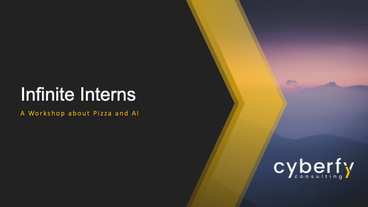

# Infinite Interns SDS 2025 - Get AI Agents to Do Your Busy Work

This is the repository for the Infinite Interns workshop at SDS 2025, held by Cyberfy Consulting. 



In this workshop, the participants will learn how to:

* Make direct API calls to OpenAI
* Build custom agents with LangGraph
* Integrate local and online tools via the Model Context Protocol (MCP)
* Orchestrate multi-agent workflows to automate complex tasks
* Implement Human-in-the-loop (HIL) systems to review and approve tool calls
* Handle security issues such as malicious implementations and prompt injection attacks

## Prerequisites

- Python
- pip
- An OpenAI model hosted via Azure

## Setup

To run the workshop locally, follow these steps:

1. Clone the repository:
   ```bash
   git clone https://github.com/<your-org>/workshop-infinite-interns.git
   cd workshop-infinite-interns
   ```
2. Create and activate a virtual environment:
   ```bash
   python3 -m venv .venv
   source .venv/bin/activate
   ```
3. Install dependencies:
   ```bash
   pip install -r requirements.txt
   ```
4. Configure your credentials when prompted in the notebook.

## Project Structure

The workshop is contained in a Jupyter notebook and includes several utility scripts. The project structure is as follows:

- `workshop.ipynb`: The Jupyter Notebook used during the workshop.
- `utils/booking_db.py`: Creates an SQLite database for booking operations.
- `utils/booking_mcp_server.py`: MCP server for booking operations.
- `utils/helper_functions.py`: Shared helper functions.
- `utils/loyalty_db.py`: Creates an SQLite database for loyalty operations.
- `utils/loyalty_mcp_server.py`: MCP server for loyalty operations.
- `images/`: Directory containing images and slides used in the notebook.